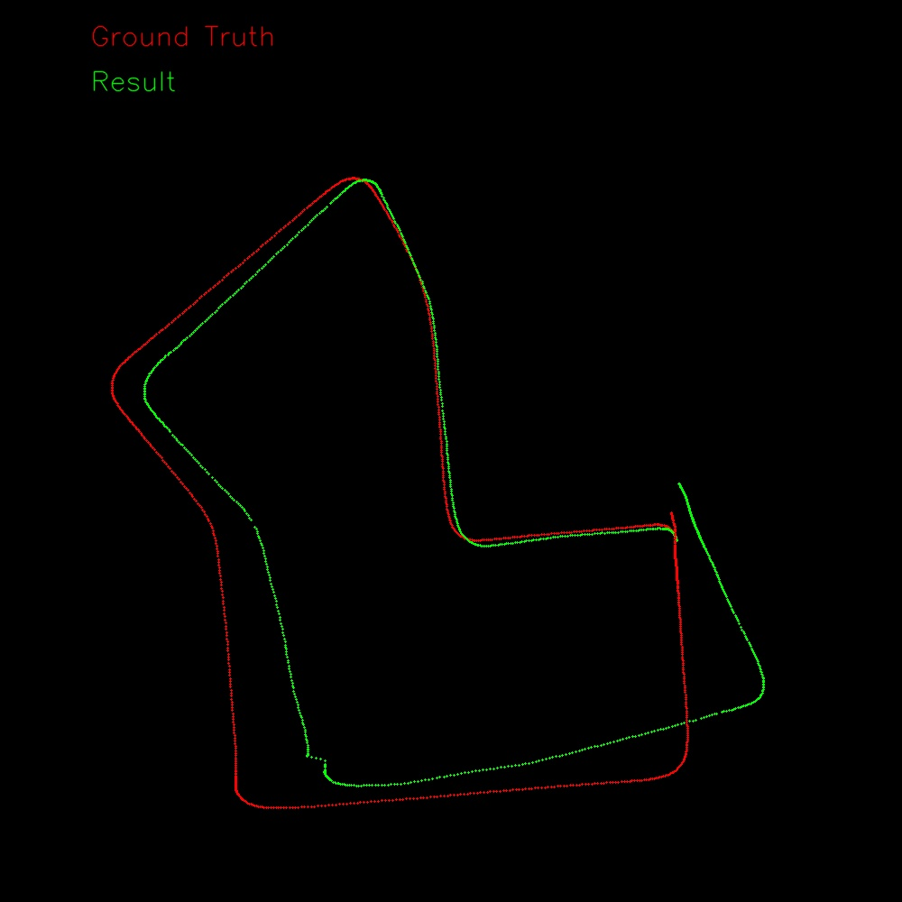

# Visual-Odometry
This is an implementation of feature-based stereo Visual Odometry. 

The pipeline consists of three main steps: feature extraction, triangulation, and motion estimation.

## Pipeline
### 0. Rectification + Sync
Before processing the dataset, rectification and synchronization need to be performed. 

The KITTI odometry dataset is already rectified and synchronized, so this step is not required.
### 1. Feature extraction
In the first step, features are extracted from the stereo image pairs. 

In this implementation, the ORB feature detector and descriptor is used.

### 2. Triangulation
The next step is to perform triangulation to recover the 3D points. 

To achieve this, stereo matching through the epipolar line is implemented to find matching feature points efficiently in the rectified image pairs. 

This part is referred to the algorithms of ORB-SLAM2 and stella_vslam. 

Then, the cv::TriangulatePoints function with the DLT algorithm is used to compute the 3D positions of the feature points.

### 3. MotionEstimation
The final step is to estimate the camera motion using the 3D feature points obtained from triangulation. 

In this implementation, the cv::solvePnPRansac function is used to estimate the initial value of relative motion.

then cv::solvePnPRefineLM is used to optimize relative motion.

## Result
