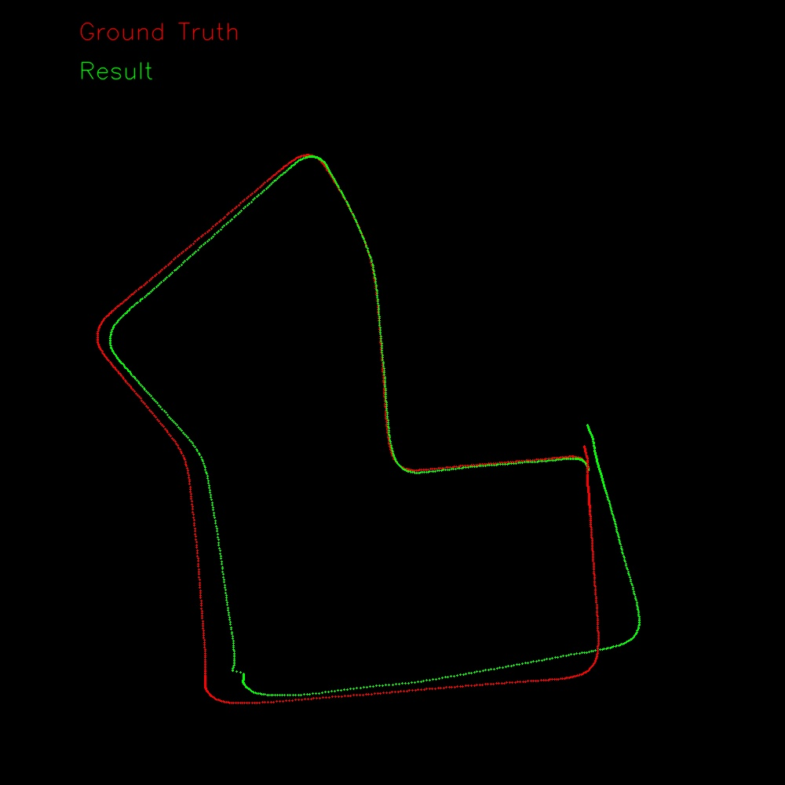

# Visual-Odometry
Stereo camera, feature based Visual Odometry

## Pipeline
### 1. Feature extraction
used ORB feature

### 2. Triangulation
used BFMatcher and cv::TriangulatePoints(DLT algorithm)

### 3. MotionEstimation
used cv::solvePnPRansac

## Result
